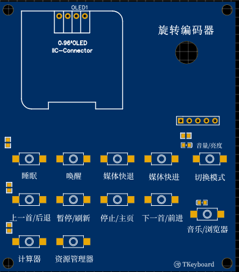
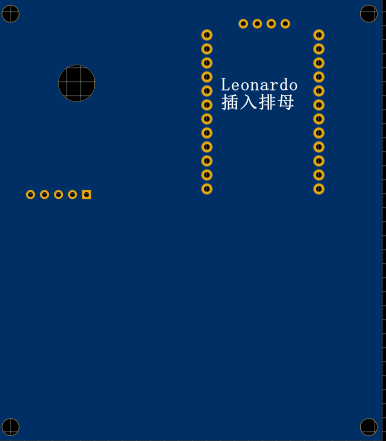
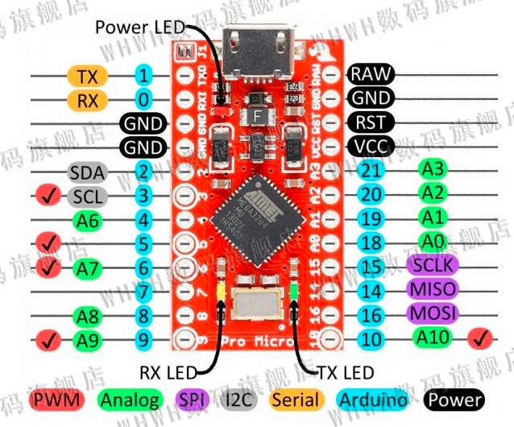

# TKeyboard

Leonardo Pro Micro使用ATMega32U4的USB通信功能

## 教程

### 组装

​	共计由两块电路板组装，所有电路集中在主电路板上，floor作为底部支撑，没有电路，两块电路板由4个M3螺丝组装。


<p style="text-align:center;">电路板正面图-使用立创EDA 2D功能</p>



<p style="text-align:center;">电路板背面图-使用立创EDA 2D功能</p>



1. 焊接好正面元件
2. 如电路板背面图在电路板背面焊接两排1x12排母
3. 在背面左侧焊接1x5排针
4. 将KY-040从背面插入圆孔，固定，将KY-040上的排针与步骤三的排针使用引线连接
5. 将Leonardo Pro Micro插入排母
6. 使用M3螺丝将电路板与底板连接起来


### 使用

旋钮存在两种模式，音量调节/亮度调节，按下 切换模式 按钮切换。

+ 处于音量调节模式时，音量/亮度指示灯亮起，左旋减小音量，右旋增加音量，按下切换静音
+ 处于亮度调节模式时，音量/亮度指示灯熄灭，左旋降低亮度，右旋增加亮度，按下切换静音

按键功能为标识所示

第二行按钮有两种模式，音乐/浏览器，按下 音乐/浏览器 按钮切换

+ 处于音乐模式时，音乐/浏览器指示灯亮起，按下按键执行 / 左边所示功能
+ 处于浏览器模式时。音乐/浏览器指示灯熄灭，按下按键执行 / 右边所示功能


### 修改

+ Pro Micro有两种，两种的电路板大小不同，排针位置不同。本项目采用Mini插口，当您购买Micro插口时候，需要改变电路板两行1x12排母位置。
+ 当您对本项目电路图进行修改时，请删去作者图标：涂，以及作者:ruxia。


## 引脚

Leonardo Pro Micro引脚示意图



| 模块                    | 数量 |
| :-----------------------: | :----: |
| Leonardo Pro Micro      | 1    |
| 旋转编码器KY-040        | 1    |
| 0.96寸OLED              | 1    |
| 按键（组成3x4矩阵键盘） | 12   |


## Leonardo引脚连线

| Leonardo引脚 |         元件         |
| :----------: | :------------------: |
|      2       |       OLED SDA       |
|      3       |       OLED SCL       |
|      5       |    LED 音量/亮度     |
|      6       |   LED 音乐/浏览器    |
|      7       | 旋转编码器KY-040 CLK |
|      8       | 旋转编码器KY-040 SW  |
|      9       | 旋转编码器KY-040 DT  |
|      10      |     3x4矩阵 1列      |
|      16      |     3x4矩阵 2列      |
|      14      |     3x4矩阵 3列      |
|      15      |     3x4矩阵 4列      |
|      20      |     3x4矩阵 1行      |
|      19      |     3x4矩阵 2行      |
|      18      |     3x4矩阵 3行      |


## 开源协议

```
BSD 3-Clause License

Copyright (c) 2021, ruxia-TJY
All rights reserved.

Redistribution and use in source and binary forms, with or without
modification, are permitted provided that the following conditions are met:

* Redistributions of source code must retain the above copyright notice, this
  list of conditions and the following disclaimer.

* Redistributions in binary form must reproduce the above copyright notice,
  this list of conditions and the following disclaimer in the documentation
  and/or other materials provided with the distribution.

* Neither the name of the copyright holder nor the names of its
  contributors may be used to endorse or promote products derived from
  this software without specific prior written permission.

THIS SOFTWARE IS PROVIDED BY THE COPYRIGHT HOLDERS AND CONTRIBUTORS "AS IS"
AND ANY EXPRESS OR IMPLIED WARRANTIES, INCLUDING, BUT NOT LIMITED TO, THE
IMPLIED WARRANTIES OF MERCHANTABILITY AND FITNESS FOR A PARTICULAR PURPOSE ARE
DISCLAIMED. IN NO EVENT SHALL THE COPYRIGHT HOLDER OR CONTRIBUTORS BE LIABLE
FOR ANY DIRECT, INDIRECT, INCIDENTAL, SPECIAL, EXEMPLARY, OR CONSEQUENTIAL
DAMAGES (INCLUDING, BUT NOT LIMITED TO, PROCUREMENT OF SUBSTITUTE GOODS OR
SERVICES; LOSS OF USE, DATA, OR PROFITS; OR BUSINESS INTERRUPTION) HOWEVER
CAUSED AND ON ANY THEORY OF LIABILITY, WHETHER IN CONTRACT, STRICT LIABILITY,
OR TORT (INCLUDING NEGLIGENCE OR OTHERWISE) ARISING IN ANY WAY OUT OF THE USE
OF THIS SOFTWARE, EVEN IF ADVISED OF THE POSSIBILITY OF SUCH DAMAGE.
```

